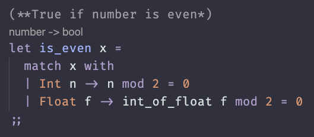

# Thor Theme

A dark VS Code theme inspired by Sebastian Lague's color scheme.

## Features
- Optimized for Python, JavaScript, and OCaml
- Custom syntax highlighting
- Carefully balanced colors

## Installation
1. Open Extensions sidebar
2. Search for "Thor Theme"
3. Click Install
4. `Ctrl/Cmd + K` > `Ctrl/Cmd + T` > Select "Thor"